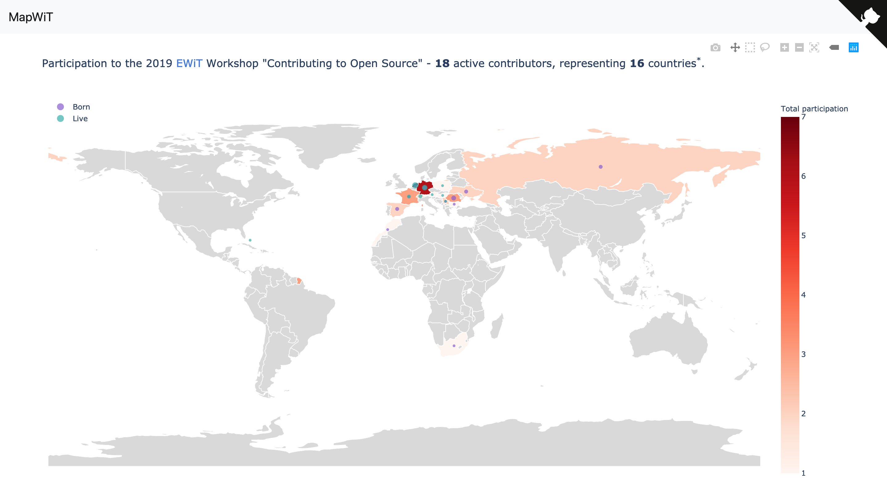

============
 MapWiT
============

**Plotting contributions during the Open Source workshop @EuropeanWomenInTechnology conference, 2019.**

.. image:: https://img.shields.io/badge/PRs-welcome-brightgreen.svg?style=flat-square
  :target: http://makeapullrequest.com

.. image:: https://img.shields.io/github/license/ludmilamarian/MapWiT?style=flat-square
  :target: https://github.com/ludmilamarian/MapWiT/blob/master/LICENSE

.. image:: https://img.shields.io/gitter/room/ludmilamarian/MapWiT?style=flat-square
  :target: https://gitter.im/MapWiT/community

This is a prototype project created for the "Contributing to OpenSource" workshop @EuropeanWomeninTechnology conference, 26-27 Nov, 2019, Amsterdam.
But it could be something else..

**How to run the app**

Once you cloned the repository, create a virtual environment for `python 3.7`,
and then, inside of the `mapwit` top folder, run the following::

  $ pip install -r requirements.txt
  $ export FLASK_APP=mapwit
  $ export FLASK_ENV=development
  $ flask run

